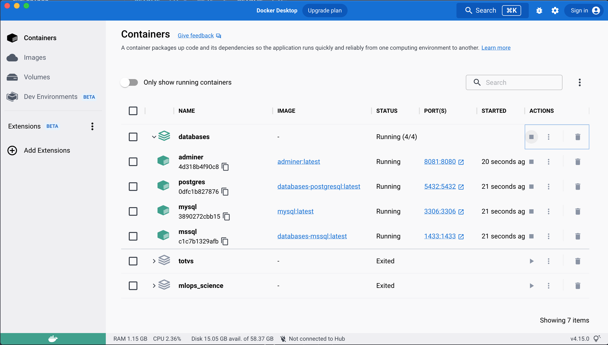

<p align=center>
  
</p>

# Databases
Neste projeto deixo uma opção para programadores, analistas, engenheiros e cientistas de dados de levantar em um único ambiente MSSQL Server, MySQL e PostgreSQL com **Docke Compose**. Assim seus testes e estudos estão garantidos!

## Estrutura do Projeto
````
.
├── README.md
├── docker-compose.yml
├── img
│   └── 01.png
├── mssql
│   ├── db_mssql.sh
│   ├── db_mssql.sql
│   ├── dockerfile.mssql
│   └── init-mssql.sh
├── postgres
│   ├── db_postgres.sh
│   └── dockerfile.postgres
└── querys
    ├── mssql.sql
    ├── oracle.sql
    └── postgresql.sql
````
> Cada database tem sua respequitiva pasta e seu dockerfile, deixo alguns scripts onde posibilita a criação de databases, rules, user, e tablespace na inicialização.

> Na pasta _**querys**_ deixo algumas querys provinientes de cursos, estaudo e trabalhos realizados.

Arquivo **.env** neste arquivo estão as variáveis de ambientes você pode altera-las se preferir. Note que neste arquivo e no _docker-compose.yml_ faço menção a redes, e coloco IP fixos nos containers, isso fica opicional utilizei pois simulos senários com sistemas e integrações onde preciso dessa característica. 

## Build
Para build do projeto basta executar o comando abaixo na raiz do projeto.
`````
# docker compose up -d
`````
<p align=center>
  
</p>

Ao final do build do projeto você deve ter esta estrutura da imagem a cima, com isso você pode utilizar o container que quizer, parando os outros, tendo uma única instância do banco que precisar. Note a ideia aqui é proporcionar uma rede de databases.

Como SGDB gosto de utilizar pgAdmin para o PostgreSQL, o Azure Data Studio para MSSQL Server e Adminer para o MySQL este último incluso no projeto.

[](https://www.linkedin.com/in/houstonsantos/)
